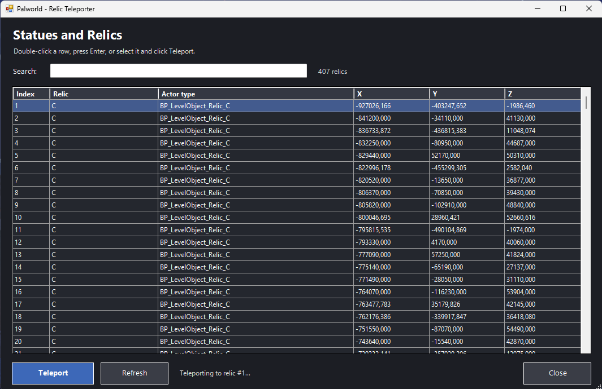

<div style="display: flex; align-items: center; position: relative;">
  

  <h1 style="position: absolute; left: 50%; transform: translateX(-50%);">
    Palworld Relic Teleporter
  </h1>
</div><br>

A small UE4SS mod for **Palworld on Windows** that displays a searchable list of relic statues and teleports the local player to the selected position.

> This is an unofficial fan project. Use it in a single-player game or on a private server where this type of mod is permitted. Back up your save before using mods.

## Features

- Opens a searchable relic selection popup with **F8**.
- Displays the relic name, Unreal actor type and exact `X`, `Y`, `Z` position.
- Teleports by double-clicking a row, pressing **Enter**, or clicking **Teleport**.
- Reloads `PalworldStatues.txt` whenever the popup is opened.
- Filters only actors whose name starts with `BP_LevelObject_Relic`.
- Excludes notes, tower pickups and unrelated objects that also use `ObtainFX`.

## Requirements

- Palworld on Windows.
- A working UE4SS installation for Palworld.
- Windows PowerShell and Windows Forms, which are included with normal Windows installations.
- `PalworldStatues.txt`, included in this package.

## Installation

1. Install and test UE4SS in your Palworld directory first.
2. Open the following folder:

   ```text
   ...\Steam\steamapps\common\Palworld\Pal\Binaries\Win64
   ```

3. Open the `install` folder from this package.
4. Copy **all contents inside `install`** into Palworld's `Win64` folder.
5. Preserve the included folder structure.

After installation, the relevant files should look like this:

```text
Pal\Binaries\Win64
├── PalworldStatues.txt
└── ue4ss
    └── Mods
        └── RelicTeleporterMenu
            ├── enabled.txt
            └── Scripts
                ├── main.lua
                └── RelicMenu.ps1
```

`enabled.txt` must exist so UE4SS loads the mod.

## Usage

1. Start Palworld.
2. Load a save and wait until your character can move.
3. Press **F8**.
4. Select a relic in the popup.
5. Double-click the row, press **Enter**, or click **Teleport**.
6. The popup sends the selection to the Lua mod, Palworld returns to the foreground, and your character is teleported to that relic.

Pressing **F8** again while the popup is already open refreshes the relic list and brings the existing window back to the foreground.

## Popup controls



The popup contains:

- **Search:** filters by relic name, Unreal actor type or numeric index.
- **Relic table:** displays the index, readable relic name, actor type and coordinates.
- **Teleport:** teleports to the currently selected row.
- **Refresh:** reloads the generated popup data.
- **Close:** closes the popup.
- **Double-click:** immediately teleports to the selected row.
- **Enter:** teleports to the selected row.
- **Escape:** closes the popup.

The popup is a separate native Windows window rather than an in-game Unreal Engine overlay. **Borderless windowed mode** is recommended so the popup can appear cleanly above the game.

## Updating the relic list

Replace this file:

```text
Pal\Binaries\Win64\PalworldStatues.txt
```

Then press **F8** again. The Lua script reloads the file and regenerates the popup list.

The parser expects entries containing lines similar to:

```text
Actor : BP_LevelObject_Relic_C /Game/...
Position : X=-26300.373 | Y=-88939.810 | Z=3833.230
```

## Troubleshooting

### F8 does nothing

- Confirm UE4SS is running.
- Confirm `enabled.txt` exists.
- Check the UE4SS console for messages beginning with:

  ```text
  [RelicTeleporterMenu]
  ```

- Make sure Palworld has focus when pressing F8.

### The popup does not open

- Confirm `RelicMenu.ps1` is next to `main.lua`.
- Confirm Windows PowerShell is available.
- Check whether antivirus software blocked the PowerShell process.
- Read the UE4SS console for the missing-file or launch error.

### The popup appears behind Palworld

Use **Borderless Windowed** or normal windowed mode. Exclusive fullscreen can prevent a separate Windows popup from appearing above the game.

### The list is empty

Confirm `PalworldStatues.txt` is located directly inside:

```text
Pal\Binaries\Win64
```

The file must contain actors beginning with `BP_LevelObject_Relic`.

### Teleportation is refused

- Make sure a save is fully loaded.
- Make sure the local player pawn exists.
- Try selecting the relic again after the destination area has loaded.
- Use the mod only in an environment where teleportation is allowed.

## Package contents

```text
Palworld-Relic-Teleporter
├── README.md
├── assets
│   └── logo.png
├── docs
│   └── .gitkeep
└── install
    ├── PalworldStatues.txt
    └── ue4ss
        └── Mods
            └── RelicTeleporterMenu
                ├── enabled.txt
                └── Scripts
                    ├── main.lua
                    └── RelicMenu.ps1
```
